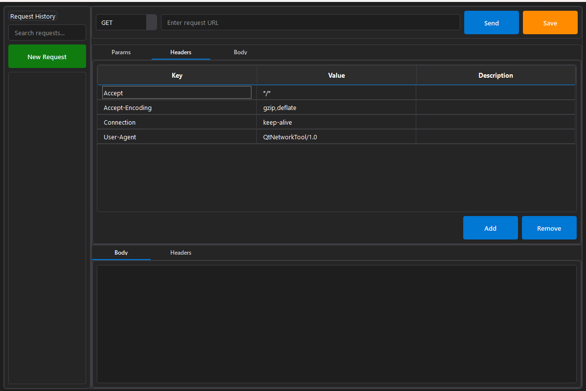
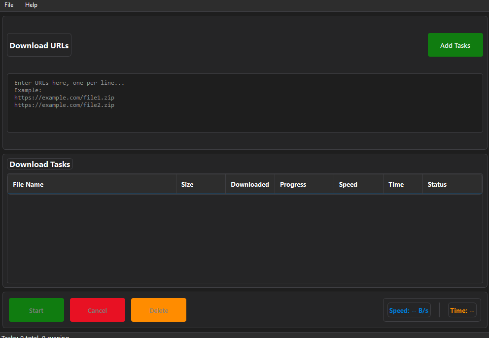

# QtMultiThreadNetwork

[](https://opensource.org/licenses/MIT)
[](https://www.qt.io)
[](https://www.qt.io)
[](https://isocpp.org/)
[](#)

A high-performance, thread-safe C++ library that provides multi-threaded HTTP(S)/FTP networking capabilities built on top of Qt's Network module.

## Table of Contents

- [Features](#features)
- [Requirements](#requirements)
- [Installation](#installation)
- [Quick Start](#quick-start)
- [Usage Examples](#usage-examples)
- [API Reference](#api-reference)
- [Building](#building)
- [Testing](#testing)
- [Contributing](#contributing)
- [License](#license)
- [Changelog](#changelog)

## Features

### 🚀 Core Capabilities
- **Multi-threaded Architecture**: Each request executes in separate threads using a managed thread pool
- **Concurrent Operations**: Support for both single and batch request modes
- **Multi-threaded Downloads**: Large file downloads with multiple channels for faster performance (auto-detects CPU cores when threadCount=0)
- **Protocol Support**: HTTP(S)/FTP with full request method support (GET/POST/PUT/DELETE/HEAD)
- **Asynchronous API**: Non-blocking operations with signal/slot progress reporting
- **Thread Safety**: All public methods are thread-safe with atomic operations

### 🛠️ Advanced Features
- **Memory-Mapped Files**: Efficient file I/O for large downloads using platform-specific APIs
- **Batch Operations**: Group multiple requests with aggregated progress tracking
- **Error Handling**: Automatic retry mechanisms and comprehensive error reporting
- **Progress Tracking**: Real-time progress updates for downloads, uploads, and batch operations
- **Cross-Platform**: Windows, Linux, and macOS support with platform-specific optimizations

### 📦 Sample Applications
- **QtNetworkRequestTool**: GUI demo application for testing HTTP requests (located in `samples/networkrequesttool/`)
- **QtNetworkDownloader**: Download manager with intelligent multi-threading support (located in `samples/networkdownloader/`)
- **Unit Tests**: Comprehensive test suite covering all functionality

## Requirements

### Build Requirements
- **C++17 compatible compiler** (MSVC 2017+, GCC 7+, Clang 6+)
- **Qt 5.6.x+** with Core, Network, Widgets, Xml, Test modules
- **CMake 3.15+** (recommended) or QMake
- **OpenSSL 1.1.1** for HTTPS support

### Platform-Specific Requirements

#### Windows
- Visual Studio 2017+ or MSVC build tools
- Windows SDK
- OpenSSL DLLs (included in ThirdParty/)

#### Linux
- GCC 7+ or Clang 6+
- OpenSSL development packages: `libssl-dev`, `libcrypto-dev`

#### macOS
- Xcode 10+ (Clang)
- OpenSSL via Homebrew or system packages

## Installation

### Using CMake (Recommended)

```bash
# Clone the repository
git clone https://gitee.com/vilasj/qt-network-request.git
cd qt-network-request

# Configure and build (Windows)
cmake -S . -B build -G "Visual Studio 17 2022" -A x64 -DCMAKE_BUILD_TYPE=Release
cmake --build build --config Release --parallel

# Configure and build (Linux/macOS)
cmake -S . -B build -DCMAKE_BUILD_TYPE=Release
cmake --build build --config Release --parallel

# Install (optional)
cmake --install build --prefix /usr/local
```

### Using QMake

```bash
# Generate Visual Studio solution
qmake -r -tp vc QtNetworkRequest.pro

# Build using nmake
qmake
nmake release
```

### Using Provided Scripts

#### Windows

```bash
# Windows build script
scripts\build_win.bat

# Generate Visual Studio solution
GenerateVsSln.bat
```

#### Linux

```bash
# Linux build script (requires execution permissions)
chmod +x scripts/build_linux.sh
./scripts/build_linux.sh

# Build with debug symbols
./scripts/build_linux.sh --debug

# Clean build and run tests
./scripts/build_linux.sh --clean --tests
```

## Quick Start

### Basic Usage

```cpp
#include "networkrequestdefs.h"
#include "networkrequestmanager.h"
#include "networkreply.h"

// Initialize in main thread
NetworkRequestManager::initialize();

// Create request context
auto req = std::make_unique<QtNetworkRequest::RequestContext>();
req->url = "https://example.com/file.zip";
req->type = QtNetworkRequest::RequestType::MTDownload;
req->behavior.showProgress = true;

// Configure download settings
req->downloadConfig = std::make_unique<QtNetworkRequest::DownloadConfig>();
req->downloadConfig->saveDir = "downloads";
req->downloadConfig->overwriteFile = true;
req->downloadConfig->threadCount = 0; // 0 = auto detect CPU cores
/*
 * Thread count options:
 * - 0: Auto detect CPU cores (recommended for most cases)
 * - 1: Single-threaded download
 * - N>1: Use N threads for multi-threaded download
 */

// Execute asynchronously
auto reply = NetworkRequestManager::globalInstance()->postRequest(std::move(req));
if (reply) {
    connect(reply.get(), &NetworkReply::requestFinished, this, &MyClass::onFinished);
}

// Cleanup before exit
NetworkRequestManager::unInitialize();
```

### Batch Operations

```cpp
// Prepare batch requests
QtNetworkRequest::BatchRequestPtrTasks tasks;
for (const QString& url : urls) {
    auto req = std::make_unique<QtNetworkRequest::RequestContext>();
    req->url = url;
    req->type = QtNetworkRequest::RequestType::Download;
    req->downloadConfig = std::make_unique<QtNetworkRequest::DownloadConfig>();
    req->downloadConfig->saveDir = "downloads";
    tasks.push_back(std::move(req));
}

// Execute batch with progress tracking
quint64 batchId = 0;
auto reply = NetworkRequestManager::globalInstance()->postBatchRequest(tasks, batchId);
if (reply) {
    connect(reply.get(), &NetworkReply::requestFinished, this, &MyClass::onBatchFinished);
}
```

## Usage Examples

### example
Network Request Tool demo


MultiThread Downloader demo


### File Download

```cpp
auto req = std::make_unique<QtNetworkRequest::RequestContext>();
req->url = "https://httpbin.org/image/png";
req->type = QtNetworkRequest::RequestType::Download;
req->behavior.showProgress = true;

req->downloadConfig = std::make_unique<QtNetworkRequest::DownloadConfig>();
req->downloadConfig->saveDir = "Download";
req->downloadConfig->overwriteFile = true;

auto reply = NetworkRequestManager::globalInstance()->postRequest(std::move(req));
if (reply) {
    connect(reply.get(), &NetworkReply::requestFinished, this, &MyClass::onDownloadFinished);
}
```

### File Upload

```cpp
auto req = std::make_unique<QtNetworkRequest::RequestContext>();
req->url = "https://httpbin.org/post";
req->type = QtNetworkRequest::RequestType::Upload;
req->behavior.showProgress = true;

req->uploadConfig = std::make_unique<QtNetworkRequest::UploadConfig>();
req->uploadConfig->filePath = "resources/1.png";
req->uploadConfig->usePutMethod = false;

auto reply = NetworkRequestManager::globalInstance()->postRequest(std::move(req));
if (reply) {
    connect(reply.get(), &NetworkReply::requestFinished, this, &MyClass::onUploadFinished);
}
```

### HTTP GET Request

```cpp
auto req = std::make_unique<QtNetworkRequest::RequestContext>();
req->url = "https://httpbin.org/get?userId=123&userName=456";
req->type = QtNetworkRequest::RequestType::Get;
req->behavior.retryOnFailed = true;
req->behavior.maxRedirectionCount = 3;

auto reply = NetworkRequestManager::globalInstance()->postRequest(std::move(req));
if (reply) {
    connect(reply.get(), &NetworkReply::requestFinished, this, &MyClass::onGetFinished);
}
```

### HTTP POST Request

```cpp
auto req = std::make_unique<QtNetworkRequest::RequestContext>();
req->url = "https://httpbin.org/post";
req->type = QtNetworkRequest::RequestType::Post;
req->body = "userId=123&userName=456";
req->behavior.retryOnFailed = true;
req->behavior.maxRedirectionCount = 3;

auto reply = NetworkRequestManager::globalInstance()->postRequest(std::move(req));
if (reply) {
    connect(reply.get(), &NetworkReply::requestFinished, this, &MyClass::onPostFinished);
}
```

### Request Management

```cpp
// Stop single request
quint64 taskId = 1;
NetworkRequestManager::globalInstance()->stopRequest(taskId);

// Stop batch requests
quint64 batchId = 1;
NetworkRequestManager::globalInstance()->stopBatchRequests(batchId);

// Stop all requests
NetworkRequestManager::globalInstance()->stopAllRequest();
```

## API Reference

### Core Classes

#### NetworkRequestManager
Singleton class that manages the thread pool and request lifecycle.

**Key Methods:**
- `initialize()`: Initialize the manager (must be called in main thread)
- `unInitialize()`: Cleanup resources (must be called in main thread)
- `postRequest(RequestContext)`: Execute a single request
- `postBatchRequest(BatchRequestPtrTasks)`: Execute batch requests
- `stopRequest(quint64)`: Stop a specific request
- `stopBatchRequests(quint64)`: Stop batch requests
- `stopAllRequest()`: Stop all active requests

**Signals:**
- `downloadProgress(quint64, qint64, qint64)`: Download progress for a single request.
- `uploadProgress(quint64, qint64, qint64)`: Upload progress for a single request.
- `batchDownloadProgress(quint64, qint64)`: Aggregated download progress for a batch of requests.
- `batchUploadProgress(quint64, qint64)`: Aggregated upload progress for a batch of requests.

#### RequestContext
Configuration structure for network requests (replaces the old RequestTask).

**Key Properties:**
- `url`: Target URL
- `type`: Request type (Download, Upload, Get, Post, Put, Delete, Head)
- `headers`: Request headers (QMap<QByteArray, QByteArray>)
- `body`: Request body for POST/PUT
- `behavior.showProgress`: Enable progress reporting
- `behavior.retryOnFailed`: Enable retry mechanism
- `behavior.maxRedirectionCount`: Maximum redirect limit
- `downloadConfig`: Download configuration (saveDir, overwriteFile, threadCount)
- `uploadConfig`: Upload configuration (filePath, usePutMethod, useFormData)
- `userContext`: User-defined context data

#### NetworkReply
Handles the asynchronous response for a single request or a batch of requests.

**Signals:**
- `requestFinished(QSharedPointer<ResponseResult>)`: Emitted when the request is complete (either successfully or with an error).

#### ResponseResult
Structure containing request response data.

**Key Properties:**
- `success`: Whether the request succeeded
- `cancelled`: Whether the request was cancelled
- `errorMessage`: Error message if failed
- `body`: Response body data
- `headers`: Response headers
- `performance.durationMs`: Request duration in milliseconds
- `performance.bytesReceived`: Bytes received
- `performance.bytesSent`: Bytes sent
- `userContext`: User-defined context data

#### DownloadConfig
Configuration structure for download operations.

**Key Properties:**
- `saveFileName`: Custom filename for the downloaded file
- `saveDir`: Directory to save the downloaded file
- `overwriteFile`: Whether to overwrite existing files (default: false)
- `threadCount`: Number of download threads for multi-threaded downloads (default: 0 = auto detect CPU cores)

#### UploadConfig
Configuration structure for upload operations.

**Key Properties:**
- `filePath`: Path to the file to upload
- `data`: Raw data to upload
- `usePutMethod`: Use HTTP PUT method instead of POST (default: false)
- `useStream`: Use streaming upload (default: false)
- `useFormData`: Use multipart form data (default: false)

## Building

### Build Configuration

The library supports both CMake and QMake build systems with standardized naming:

- **CMake**: Modern, cross-platform build system with automatic dependency detection
- **QMake**: Traditional Qt build system with Visual Studio integration

### Build Targets

**CMake Targets:**
- `QNetworkRequest`: Core library (DLL)
- `QtNetworkRequestTool`: GUI demo application (source in `samples/networkrequesttool/`)
- `QtNetworkDownloader`: Download manager application (source in `samples/networkdownloader/`)
- `UnitTests`: Test suite

**QMake Targets:**
- `QNetworkRequest`: Core library (DLL)
- `QtNetworkRequestTool`: GUI demo application (source in `samples/networkrequesttool/`)
- `QtNetworkDownloader`: Download manager application (source in `samples/networkdownloader/`)

### Build Types

```bash
# CMake Release build
cmake -S . -B build -G "Visual Studio 17 2022" -A x64 -DCMAKE_BUILD_TYPE=Release
cmake --build build --config Release

# CMake Debug build
cmake -S . -B build -G "Visual Studio 17 2022" -A x64 -DCMAKE_BUILD_TYPE=Debug
cmake --build build --config Debug

# QMake build
qmake -r -tp vc QtNetworkRequest.pro
nmake release
nmake debug
```

### Build Scripts

```bash
# Windows build script
scripts\build_win.bat

# Generate Visual Studio solution
GenerateVsSln.bat
```

### Cross-Platform Building

#### Using CMake Directly

```bash
# Linux
cmake -S . -B build -DCMAKE_BUILD_TYPE=Release
cmake --build build --config Release

# macOS
cmake -S . -B build -DCMAKE_BUILD_TYPE=Release
cmake --build build --config Release

# Windows
cmake -S . -B build -G "Visual Studio 17 2022" -A x64
cmake --build build --config Release
```

#### Using Build Scripts

```bash
# Windows (batch script)
scripts\build_win.bat

# Linux (shell script)
chmod +x scripts/build_linux.sh
./scripts/build_linux.sh --release
```

## Cross-Platform Compatibility

QtMultiThreadNetwork is designed to work across multiple platforms with proper build configuration.

### Supported Platforms

| Platform | Status | Notes |
|----------|--------|-------|
| **Windows** | ✅ Fully Supported | Primary development platform, MSVC 2017+ |
| **Linux** | ✅ Supported | Requires build system adjustments |
| **macOS** | ✅ Supported | Requires build system adjustments |

### Component Compatibility

| Component | Windows | Linux | macOS | Status |
|-----------|---------|-------|-------|--------|
| Core Network Functions | ✅ | ✅ | ✅ | Based on Qt Network (cross-platform) |
| Memory-Mapped Files | ✅ | ✅ | ✅ | Implemented with platform-specific APIs |
| Multi-threaded Downloads | ✅ | ✅ | ✅ | Compatible across platforms |
| Thread Pool Management | ✅ | ✅ | ✅ | Uses Qt's threading framework |
| Build System | ✅ | ✅ | ⚠️ | Requires CMake adjustments |
| OpenSSL Integration | DLL | Dynamic | Dynamic | Platform-specific linking |

### Platform-Specific Implementations

#### Memory-Mapped Files
- **Windows**: Uses `CreateFileMapping` / `MapViewOfFile`
- **Linux/macOS**: Uses `mmap` / `munmap`
- **File Size**: Supports large files (>4GB) on all platforms

#### Build Requirements

#### Windows
- **Compiler**: MSVC 2017+
- **Qt**: 5.6.x+ 
- **OpenSSL**: DLL files (libeay32.dll, ssleay32.dll)

#### Linux
- **Compiler**: GCC 7+ or Clang 6+
- **Qt**: 5.6.x+
- **OpenSSL**: Development packages (libssl-dev, libcrypto-dev)
- **Build**: CMake 3.15+

#### macOS
- **Compiler**: Xcode 10+ (Clang)
- **Qt**: 5.6.x+
- **OpenSSL**: Homebrew or system packages
- **Build**: CMake 3.15+

### Known Limitations

1. **DLL Entry Point**: `dllmain.cpp` is Windows-only and conditionally compiled
2. **OpenSSL Handling**: Platform-specific dynamic library linking
3. **Build Scripts**: Currently Windows-focused, needs Unix equivalents

### Cross-Platform Build Instructions

```bash
# Linux/macOS build
cmake -S . -B build -DCMAKE_BUILD_TYPE=Release
cmake --build build --config Release

# Find and link OpenSSL automatically on Unix systems
find_package(OpenSSL REQUIRED)
target_link_libraries(QNetworkRequest PRIVATE OpenSSL::SSL OpenSSL::Crypto)
```

### Migration Guide

To port existing Windows projects to other platforms:

1. **Remove Windows-specific flags**: Remove `WIN32` from executable targets
2. **Adjust OpenSSL linking**: Use system OpenSSL packages instead of DLLs
3. **Update paths**: Replace Windows-style paths with cross-platform equivalents
4. **Test threading**: Verify thread pool behavior on target platform

The core library functionality is platform-agnostic and should work seamlessly across all supported platforms with proper build configuration.

## Testing

### Running Tests

```bash
# Using CTest
cd build
ctest -C Release

# Direct execution
./test/Release/UnitTests.exe
```

### Test Coverage

The test suite covers:
- Basic request functionality
- Error handling scenarios
- Progress reporting
- Thread safety
- Memory management
- Platform-specific implementations

## Contributing

We welcome contributions! Please follow these guidelines:

1. **Fork the repository** and create a feature branch
2. **Follow the existing code style** and patterns
3. **Add tests** for new functionality
4. **Update documentation** as needed
5. **Submit a pull request** with a clear description

### Development Setup

```bash
# Clone with submodules
git clone --recursive https://gitee.com/vilasj/qt-network-request.git

# Setup development build
cmake -S . -B build-dev -DCMAKE_BUILD_TYPE=Debug -DBUILD_TESTS=ON
cmake --build build-dev --config Debug
```

### Code Style

- Use C++17 features and modern C++ practices
- Follow Qt coding conventions
- Use smart pointers for memory management
- Implement proper error handling
- Add comprehensive documentation

## License

This project is licensed under the MIT License - see the [LICENSE](LICENSE) file for details.

**Copyright © 2025 Vilas Wang. All rights reserved.**
